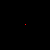

# Robo Walker

Teach a virtual robot how to walk a 2D grid using programmed instructions.

## Instructions

- `U` = Up
- `R` = Right
- `D` = Down
- `L` = Left

Each instruction is optionally followed by a displacement number for repeated steps in the same direction like `R2`, `U3`, `L10`, etc.

These directions are relative to the viewer instead of robot.

## Program

Combine instructions together to create a navigation program for the robot.

### Example

Navigation steps -

1. Go up by two steps
2. Go right by one step
3. Go down by five steps
4. Go right by two steps
5. Go up by one step
6. Go left by ten steps

Navigation program -

```
U2RD5R2U1L10
```

## Build and Run

**Start Server**

1. `git clone https://github.com/cod3rboy/robo-walker.git`
2. `cd robo-walker`
3. `go run ./app`

Server listens at address `:8880`

**Run Navigation Code**

1. Open [http://localhost:8880/\<navigation-code\>](http://localhost:8880/U1R2D3L4U5R6D7L8U9R1D2L3U4R5D6L7U8R9D1L2U3R4D5L) in your browser
2. Browser sends the program to the localhost server, server executes the instructions.
3. The output is generated in the form of GIF image animating the robot along the navigation path.
4. Server sends the page containing the GIF image output to the browser.

## GIF Output Customization

Server supports GIF output customization through following query parameters in the URL.

|     | Parameter | Description                                                                                                                       | Example                |
| --- | --------- | --------------------------------------------------------------------------------------------------------------------------------- | ---------------------- |
| 1   | `d`       | Controls frame speed in output GIF. `1` means a second, `0.5` means half second, `2` means two seconds.<br>Default - `0.1`        | `d=0.10`               |
| 2   | `gs`      | Size of a square grid in which the robot navigates.<br>Default - `100`                                                            | `gs=50`                |
| 3   | `imgs`    | Size of the output GIF image. <br>Default - `200`                                                                                 | `imgs=250`             |
| 4   | `bgc`     | Hexadecimal format background color RRGGBBAA of the output GIF image.<br>Default - `000000FF`                                     | `bgc=FFFFFFFF` (white) |
| 5   | `fgc`     | Hexadecimal format color RRGGBBAA highlighting the trail left by the robot in the output GIF animation.<br>Default - `00FF00FF`   | `fgc=00FF00FF` (green) |
| 6   | `posc`    | Hexadecimal format color RRGGBBAA highlighting the current position of robot in the output GIF animation.<br>Default - `FF0000FF` | `posc=FF0000FF` (red)  |

**Example Usage:**
[http://localhost:8880/\<navigation-code\>?gs=50&imgs=250&d=0.1&bgc=555555FF&fgc=00FF00FF&posc=FF0000FF](http://localhost:8880/U1R2D3L4U5R6D7L8U9R1D2L3U4R5D6L7U8R9D1L2U3R4D5L?gs=50&imgs=250&d=0.1&bgc=555555FF&fgc=00FF00FF&posc=FF0000FF)
